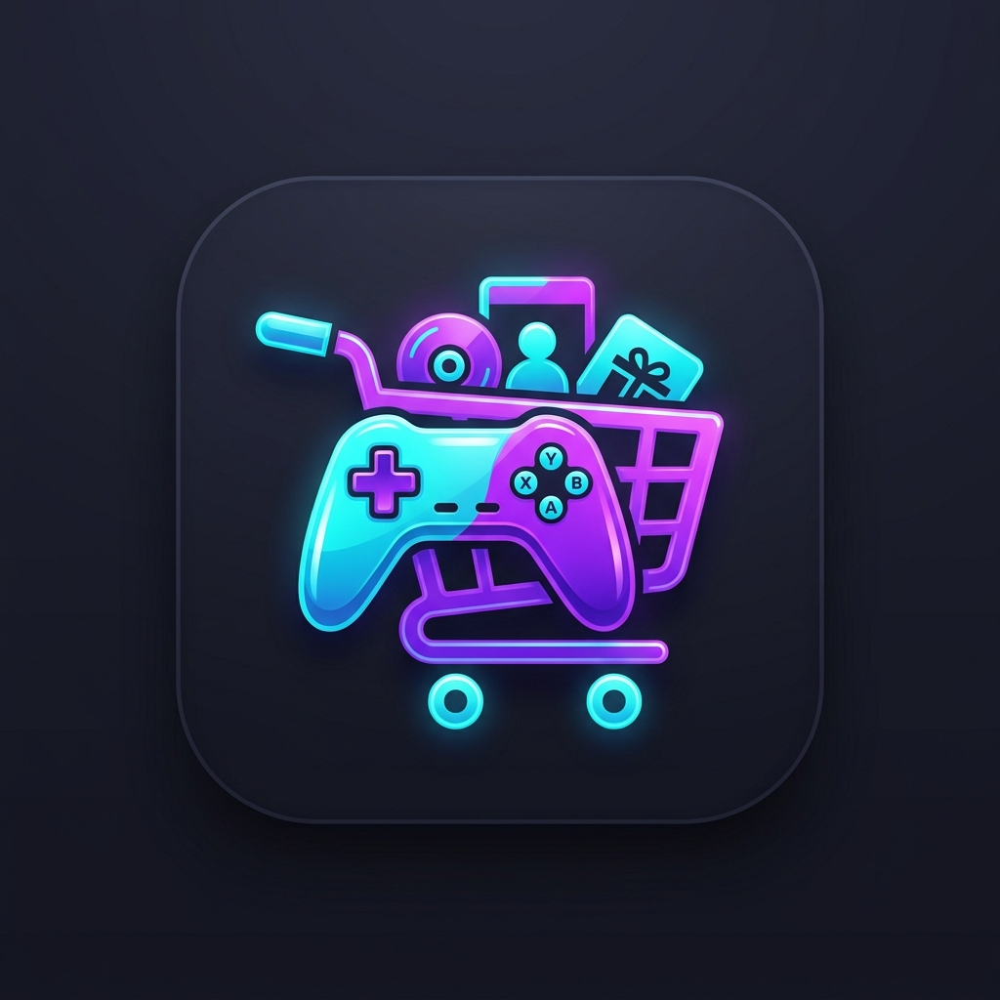

# 🎮 GameStore Manager — Odoo 18 ERP Module

<p align="center">
  
</p>

<p align="center">
  <strong>Módulo ERP para la gestión integral de tiendas de videojuegos construido sobre Odoo 18 Community.</strong><br>
  Diseñado para gestionar catálogo multimedia, clientes enriquecidos, ciclo de vida de pedidos, control automático de inventario, informes analíticos en PostgreSQL y API REST JSON.
</p>

<p align="center">
  
  
  
  
  
</p>

<p align="center">
  <a href="https://github.com/codespaces/new">
    
  </a>
</p>

---

## 📌 Tabla de Contenidos

* [Probar en Vivo con 1 Clic (GitHub Codespaces)](#-probar-en-vivo-con-1-clic-github-codespaces)
* [Descripción General](#-descripción-general)
* [Características Principales](#-características-principales)
* [Arquitectura y Tecnologías](#-arquitectura-y-tecnologías)
* [Instalación Local con Docker](#-instalación-local-con-docker)
* [Credenciales y Acceso a Odoo](#-credenciales-y-acceso-a-odoo)
* [API REST y Demostración](#-api-rest-y-demostración)
* [Ejecución de Tests Automatizados](#-ejecución-de-tests-automatizados)
* [Estructura del Proyecto](#-estructura-del-proyecto)

## 🚀 Probar en Vivo con 1 Clic (GitHub Codespaces)

Puedes explorar la aplicación completa funcionando en la nube sin necesidad de tener Docker instalado en tu máquina local:

<p align="center">
  <a href="https://github.com/codespaces/new">
    
  </a>
</p>

1. Haz clic en el botón superior **Open in GitHub Codespaces** (o en tu fork: *Code > Codespaces > Create codespace*).
2. GitHub levantará el contenedor de desarrollo y arrancará **Odoo 18 + PostgreSQL 16**.
3. El script de inicio auto-inicializa la base de datos `gamestore` e instala `gamestore_manager` con catálogo y pedidos demo.
4. **El puerto `8069` se abrirá automáticamente en tu navegador**.
5. **Credenciales de inicio de sesión:**
   * **Usuario:** `admin`
   * **Contraseña:** `admin`
   * **Base de datos:** `gamestore`

---

## 📖 Descripción General

**GameStore Manager** es un proyecto enfocado a demostrar competencias sólidas en el desarrollo sobre el framework de Odoo, buenas prácticas de arquitectura de software, modelado relacional y APIs. 

A diferencia de proyectos tutoriales básicos, este módulo implementa:
* **Extensión de modelos estándar** (`res.partner`) mediante herencia en lugar de duplicar entidades.
* **Desacoplamiento transaccional** mediante arquitectura Cabecera-Líneas (`gamestore.pedido` y `gamestore.pedido.linea`).
* **Control transaccional de inventario:** validaciones previas, deducción atómica de stock en confirmación y restitución automática en cancelaciones.
* **Business Intelligence en PostgreSQL:** modelo analítico sin tabla (`_auto = False`) alimentado por una `VIEW` SQL con soporte para cubos OLAP (vistas `pivot` y `graph`).
* **Seguridad Multinivel:** control de acceso por listas (ACL / CSV) y aislamiento por usuario mediante reglas de registro (`ir.rule`).
* **Integración Externa:** controladores HTTP que exponen una API REST JSON para e-commerce o apps móviles.

---

## ✨ Características Principales

### 🎮 1. Catálogo de Videojuegos
* Gestión de títulos con carátula, clasificación PEGI, fecha de lanzamiento y descripciones enriquecidas.
* Catálogos auxiliares normalizados: **Plataformas**, **Géneros** (etiquetas con colores) y **Desarrolladoras**.
* **Control de Stock Dinámico:** cálculo en tiempo real del estado de inventario (*Disponible*, *Stock Bajo*, *Agotado*).
* Vistas: **Kanban con fichas visuales**, Lista con alertas cromáticas, Formulario con Chatter y Search Panel con filtros por facetas.

### 👤 2. Clientes (Extensión de `res.partner`)
* Integración limpia con el libro de contactos nativo de Odoo.
* Marcado automático de contactos como clientes GameStore al realizar pedidos.
* Pestaña personalizada con **historial de compras**, total gastado acumulado y cálculo de plataforma favorita.
* *Smart Button* para navegación directa hacia los pedidos del cliente.

### 🛒 3. Pedidos y Ciclo de Venta
* Máquina de estados completa: `Borrador ➔ Confirmado ➔ Pagado ➔ Entregado` (y `Cancelado`).
* Generación de referencias automáticas con secuencia (`PED/2026/0001`).
* **Congelación de precios:** los precios unitarios se capturan del catálogo al insertar la línea, garantizando integridad histórica ante futuras fluctuaciones del catálogo.
* Control estricto de inventario: impide confirmar ventas si no hay existencias suficientes.
* Vistas en lista, Kanban tipo tablero ágil y Calendario de entregas.

### ⚙️ 4. Automatizaciones y Asistentes (Wizards)
* **Asistente de Reposición Masiva:** `gamestore.reponer.stock.wizard` calcula la cantidad sugerida para alcanzar el doble del umbral mínimo de seguridad y actualiza múltiples títulos en un clic.
* **Asistente de Cancelación:** obliga a documentar el motivo de anulación y lo registra en el chatter de auditoría.
* **Cron Programado:** tarea de fondo que examina diariamente el inventario y agenda actividades pendientes a los encargados si algún título cae en estado crítico.

### 📊 5. Informes y Business Intelligence
* **Análisis de Ventas Multidimensional:** vista SQL con métricas de facturación y unidades agrupables por fecha, plataforma, desarrolladora y cliente.
* **Ranking de Videojuegos Más Vendidos:** gráficos de barras ordenados de mayor a menor.
* **Informes PDF (QWeb):**
  * Albarán / Ticket de compra con desglose y totales.
  * Informe general de inventario y estado de existencias.

---

## 🏛️ Arquitectura y Tecnologías

| Componente | Tecnología | Rol |
|---|---|---|
| **Backend / ORM** | Odoo 18.0 Community (Python 3.11+) | Lógica de negocio, ORM, controladores y seguridad |
| **Base de Datos** | PostgreSQL 16 | Almacenamiento relacional, constraints SQL y vistas analíticas |
| **Frontend ERP** | OWL (Odoo Web Library) / XML / QWeb | Renderizado de vistas, widgets y documentos PDF |
| **Contenedores** | Docker & Docker Compose | Entorno reproducible y aislado con puerto Postgres en `5433` |
| **API** | REST JSON + XML-RPC | Interoperabilidad con sistemas externos |

> Para un análisis exhaustivo del modelo entidad-relación y diagramas de estados, consulta [docs/architecture.md](docs/architecture.md).

---

## 🐳 Instalación Local con Docker

### Requisitos Previos
1. Tener instalado [Docker Desktop](https://www.docker.com/products/docker-desktop/) (abierto y en ejecución).
2. Tener instalado `git`.

### 1. Clonar el Repositorio
```bash
git clone https://github.com/tu-usuario/gamestore-manager.git
cd gamestore-manager
```

### 2. Arrancar el Entorno
Ejecuta en tu terminal (PowerShell o Bash):
```bash
docker compose up -d
```

Docker levantará los contenedores de Odoo 18 y PostgreSQL 16. El entrypoint automatizado comprobará la base de datos y, en el primer arranque, inicializará automáticamente `gamestore` con el módulo `gamestore_manager` y los datos de prueba sin necesidad de configuración manual.

---

## 🔑 Credenciales y Acceso a Odoo

1. Abre tu navegador web y accede a: **`http://localhost:8069`**
2. Inicia sesión directamente con las credenciales por defecto:
   * **Base de datos:** `gamestore`
   * **Email / Usuario:** `admin`
   * **Contraseña:** `admin`
3. ¡Listo! Accederás directamente al panel principal con la aplicación **GameStore Manager** activa, con catálogo precargado, clientes, pedidos e informes listos para explorar.

---

## 🌐 API REST y Demostración

El módulo expone endpoints REST JSON públicos que pueden ser consumidos por e-commerces externos:

| Método | Endpoint | Descripción |
|---|---|---|
| `GET` | `/api/gamestore/games` | Lista el catálogo (admite `?plataforma=PS5`, `?estado_stock=disponible`) |
| `GET` | `/api/gamestore/games/<id>` | Detalle completo de un videojuego |
| `GET` | `/api/gamestore/platforms` | Lista de plataformas y número de títulos |
| `POST` | `/api/gamestore/orders` | Crea un pedido (con opción de auto-confirmar y descontar stock) |

### Probar la API con el Script Automatizado
Con Odoo en funcionamiento, ejecuta el script de demostración:
```bash
python scripts/api_demo.py
```
Este script probará tanto los endpoints HTTP REST como la conexión nativa mediante el protocolo **XML-RPC** de Odoo.

---

## 🧪 Ejecución de Tests Automatizados

Para ejecutar la suite de pruebas unitarias (`TransactionCase`) que valida el cálculo de importes, constraints de precio y descuentos de stock:

```bash
docker compose exec odoo odoo -d gamestore -i gamestore_manager --test-enable --test-tags /gamestore_manager --stop-after-init
```

---

## 📁 Estructura del Proyecto

```
GameStore Manager/
├── docker-compose.yml              # Definición de servicios Odoo 18 + PostgreSQL 16
├── .gitignore                      # Exclusiones de Git
├── config/
│   └── odoo.conf                   # Configuración del servidor Odoo
├── docs/
│   └── architecture.md             # Documentación técnica y diagramas de arquitectura
├── scripts/
│   └── api_demo.py                 # Cliente Python demo para API REST y XML-RPC
└── addons/
    └── gamestore_manager/          # Módulo principal Odoo
        ├── __init__.py
        ├── __manifest__.py         # Metadatos, dependencias y registro de archivos
        ├── models/                 # Modelos ORM
        │   ├── catalogo.py         # Plataforma, Género, Desarrolladora
        │   ├── videojuego.py       # Modelo principal de Videojuego y stock
        │   ├── res_partner.py      # Extensión por herencia de clientes
        │   ├── pedido.py           # Cabecera de pedido y máquina de estados
        │   ├── pedido_linea.py     # Líneas de pedido con congelación de precio
        │   └── informe_ventas.py   # Vista SQL de PostgreSQL para analítica
        ├── views/                  # Vistas XML (Kanban, List, Form, Pivot, Graph)
        │   ├── catalogo_views.xml
        │   ├── videojuego_views.xml
        │   ├── res_partner_views.xml
        │   ├── pedido_views.xml
        │   ├── informe_ventas_views.xml
        │   └── menus.xml
        ├── wizards/                # Asistentes interactivos (TransientModel)
        │   ├── reponer_stock_wizard.py
        │   ├── reponer_stock_wizard_views.xml
        │   ├── cancelar_pedido_wizard.py
        │   └── cancelar_pedido_wizard_views.xml
        ├── reports/                # Informes imprimibles PDF en QWeb
        │   ├── report_pedido.xml
        │   └── report_inventario.xml
        ├── controllers/            # Controladores HTTP (API REST JSON)
        │   └── api.py
        ├── security/               # Seguridad, roles y reglas de registro
        │   ├── security.xml        # Grupos Dependiente / Encargado y reglas de registro
        │   └── ir.model.access.csv # Matriz ACL por modelo
        ├── data/                   # Automatizaciones y secuencias
        │   ├── sequence.xml        # Numeración PED/2026/0001
        │   └── cron.xml            # Tarea programada diaria de alerta de stock
        ├── demo/                   # Datos de demostración
        │   └── demo_data.xml
        ├── tests/                  # Tests unitarios automatizados
        │   ├── test_game.py
        │   └── test_order.py
        └── static/description/     # Icono y banner visual
            ├── icon.png
            └── banner.png
```

---

## 👨‍💻 Autor
Proyecto desarrollado como demostración técnica de habilidades en desarrollo Odoo 18 / Python para portfolio profesional.
* **LinkedIn:** [Tu Perfil](#)
* **GitHub:** [Tu Usuario](#)
