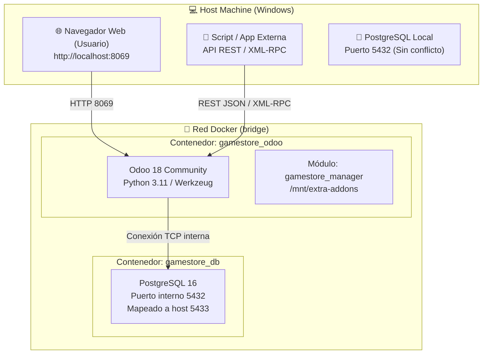
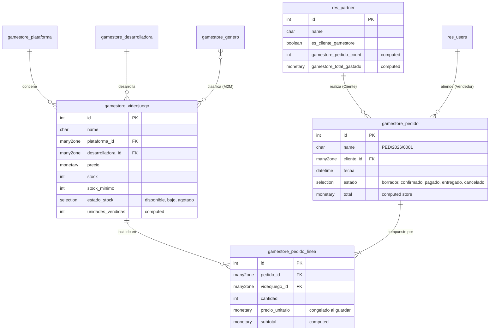
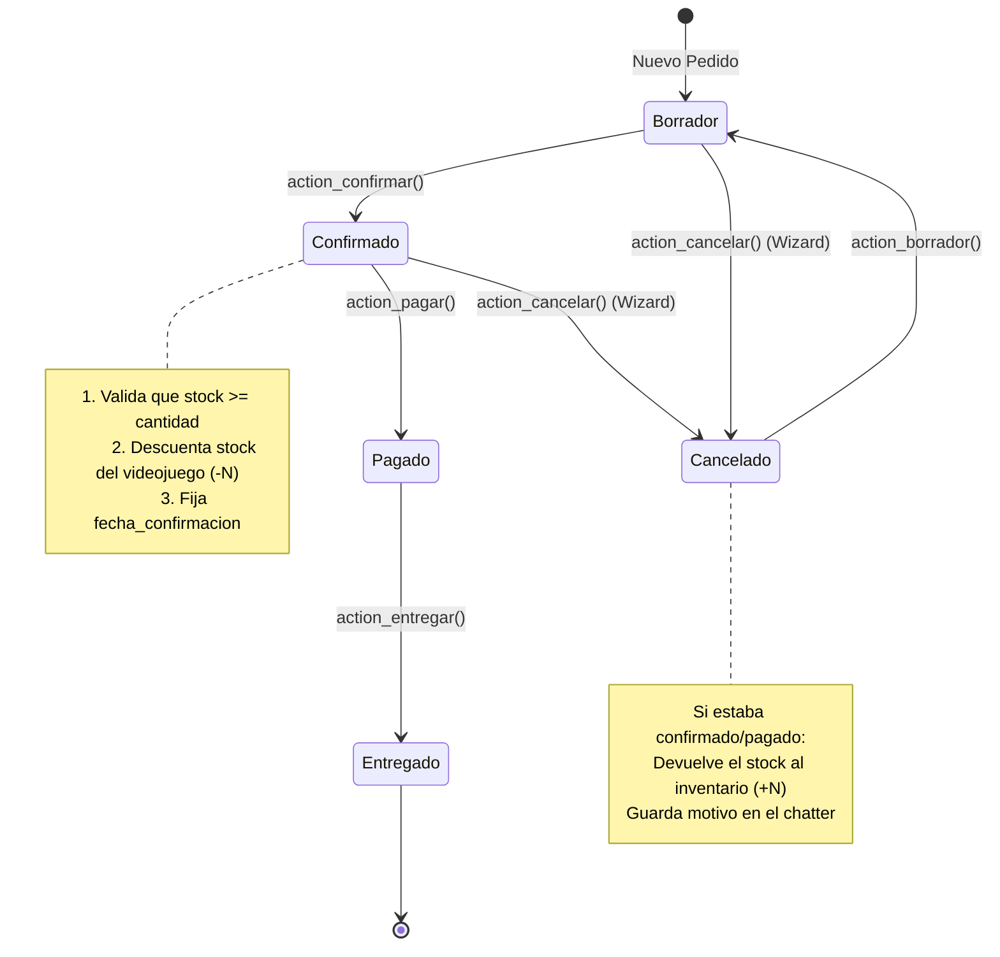

# 🏛️ GameStore Manager — Arquitectura Técnica

Este documento detalla la arquitectura de software, modelo de datos y patrones de diseño aplicados en el módulo **GameStore Manager** para Odoo 18 Community.

---

## 1. Diagrama de Infraestructura (Docker)

* **Aislamiento de Puertos:** el PostgreSQL del contenedor se expone en el puerto `5433` del host, garantizando coexistencia pacífica con cualquier instalación local previa de PostgreSQL en el puerto `5432`.
* **Modo Desarrollo:** Odoo arranca con el parámetro `--dev=reload,xml`, lo que permite recargar el código Python y las vistas XML al guardar los archivos sin reiniciar manualmente el contenedor.

---

## 2. Diagrama Entidad-Relación (Modelo de Datos)

---

## 3. Máquina de Estados del Pedido y Flujo de Stock

---

## 4. Patrones de Diseño Aplicados

### A. Herencia de Modelos (`res.partner`)
En lugar de crear un modelo aislado de clientes, se utiliza la **herencia clásica de Odoo** (`_inherit = 'res.partner'`). Esto permite:
* Reutilizar libreta de direcciones, contactos, geolocalización y chatter nativo de Odoo.
* Incorporar campos específicos (`es_cliente_gamestore`, `gamestore_total_gastado`, `gamestore_plataforma_favorita_id`).
* Añadir un *Smart Button* interactivo en la ficha de cualquier contacto.

### B. Desacoplamiento de Transacciones (Cabecera y Líneas)
Estructura tipo `gamestore.pedido` (Cabecera) y `gamestore.pedido.linea` (Detalle). El precio unitario en la línea se precalcula al elegir el videojuego, pero queda **almacenado y congelado**, evitando que futuras subidas de precio en el catálogo alteren el histórico contable de pedidos antiguos.

### C. Vistas SQL para Business Intelligence (`_auto = False`)
El modelo `gamestore.informe.ventas` no genera una tabla en disco. Utiliza el método `init()` para crear una **`VIEW` en PostgreSQL** que une pedidos, líneas y catálogos en una sola consulta optimizada. Sobre ella, Odoo monta vistas de tipo `pivot` (tabla dinámica multidimensional) y `graph` (gráficos de barras y líneas).

### D. Asistentes Transitorios (`TransientModel`)
* `gamestore.reponer.stock.wizard`: Asistente modal en memoria para reposición masiva de inventario con cantidades sugeridas automáticamente.
* `gamestore.cancelar.pedido.wizard`: Asistente para forzar la captura obligatoria de motivos de cancelación antes de revertir los stocks.

### E. Seguridad Basada en Roles (RBAC) y Reglas de Registro
1. **Grupos de Usuario:**
   * `Dependiente`: Operaciones de venta diarias (creación de clientes y pedidos). No puede borrar pedidos ni modificar precios de catálogo.
   * `Encargado`: Acceso total a catálogo, informes analíticos, configuración y asistentes de reposición.
2. **Reglas de Registro (`ir.rule`):** Un dependiente solo puede modificar y gestionar aquellos pedidos donde él figure como `vendedor_id`.
